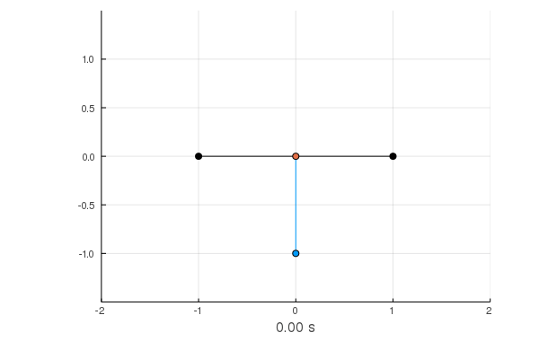

## CartPoleRL

Using Semi Gradient SARSA with small Neural Net for pole swing-up and balance on cart.

Implementation of CartPole environment in the folder `CartPole` with help of this [blog post](https://openocl.github.io/tutorials/tutorial-01-modeling-double-cartpole/).

Achievements:
- Successfully trained agent to balance single pole
- Found force inputs for swing-up of single pole with BFS

ToDos:
- Train agent to swing-up single pole
- Train agent to balance double pole
- Find force input for swing-up of double pole
- Train agent to swing-up double pole

The current state of this repository is a bit messy. The best starting point is `single_swingup/main.jl` or `single_balance/main.jl`.

Also check out my [blog post](https://markus7800.github.io/blog/ML/cartpole.html) for more details.
